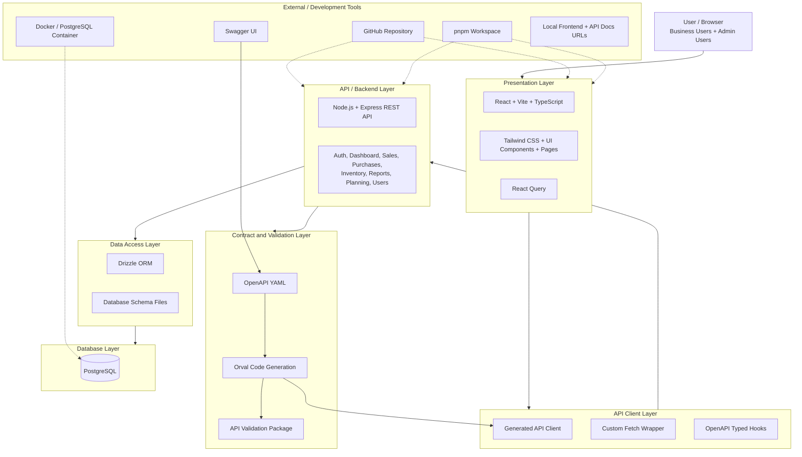

# Prompt - Kovex ERP System Architecture Diagram

Use this prompt in AI to generate a clean system architecture diagram page or Mermaid diagram.

```text
Create a professional system architecture diagram for a graduation project named "Kovex ERP".

The diagram must show these layers from top to bottom:

1. User / Browser
   - Business users
   - Admin users

2. Presentation Layer
   - React
   - Vite
   - TypeScript
   - Tailwind CSS
   - UI components and pages
   - React Query for server state

3. API Client Layer
   - Generated API client
   - OpenAPI-based typed hooks
   - Custom fetch wrapper

4. API / Backend Layer
   - Node.js
   - Express REST API
   - Route modules:
     - Auth
     - Dashboard
     - Customers
     - Suppliers
     - Products
     - Sales
     - Purchases
     - Inventory / Stock
     - Reports
     - Planning
     - Users

5. Contract and Validation Layer
   - OpenAPI YAML
   - Orval code generation
   - API validation package
   - Request and response validation

6. Data Access Layer
   - Drizzle ORM
   - Database schema files
   - Query logic

7. Database Layer
   - PostgreSQL
   - Main tables:
     - users
     - customers
     - suppliers
     - products
     - warehouses
     - stock
     - quotations
     - quotation_items
     - orders
     - order_items
     - invoices
     - invoice_items
     - purchase_orders
     - purchase_order_items
     - purchase_invoices
     - projects
     - tasks

Add external and development tools on the side:
   - Swagger UI for API documentation
   - GitHub repository
   - pnpm workspace
   - Docker / PostgreSQL container
   - Browser local development URL
   - API docs URL

Use arrows to show flow:
User / Browser -> Presentation Layer -> API Client Layer -> API / Backend Layer -> Contract and Validation Layer -> Data Access Layer -> Database Layer.

Also show that OpenAPI YAML generates the API client and validation types.

Design requirements:
   - Clean academic style
   - Light background
   - Clear boxes
   - Use different colors for frontend, backend, validation, data access, database, and external tools
   - Add the title "Kovex ERP System Architecture"
   - Add a small subtitle: "Frontend, Backend, API Contract, Validation, Data Access, Database, and External Tools"
   - Make it exportable as PNG or PDF for a graduation report
```

## Optional Mermaid Version


