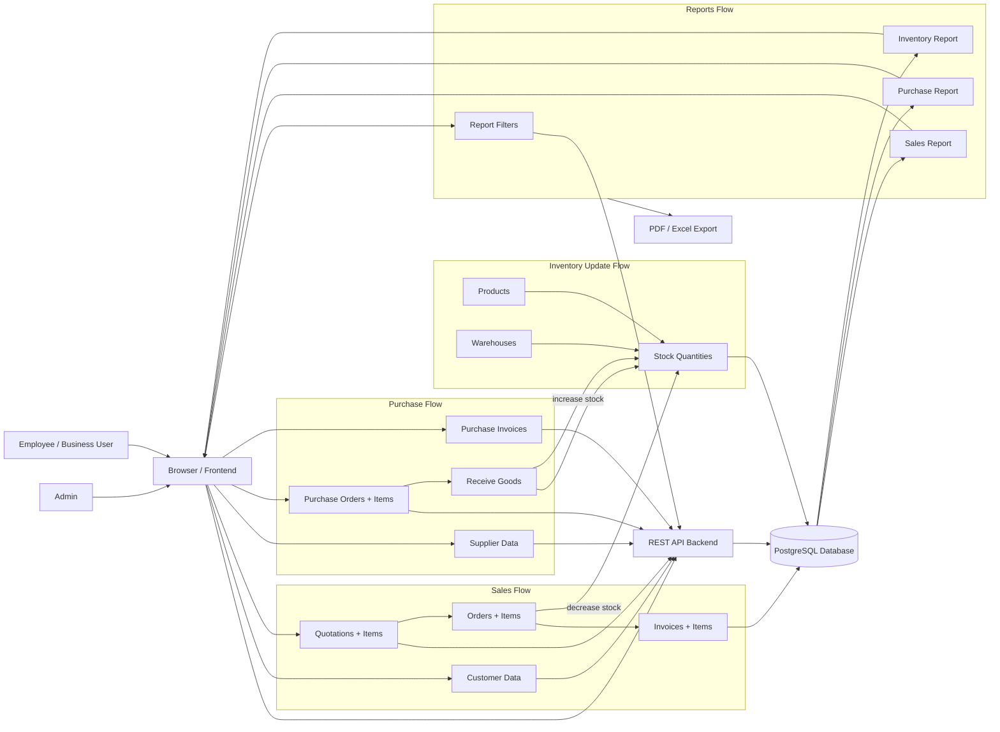
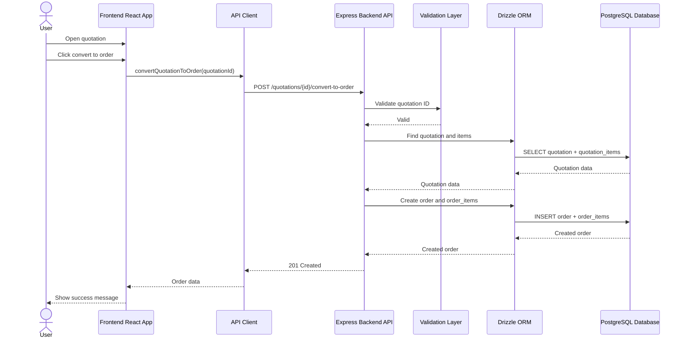
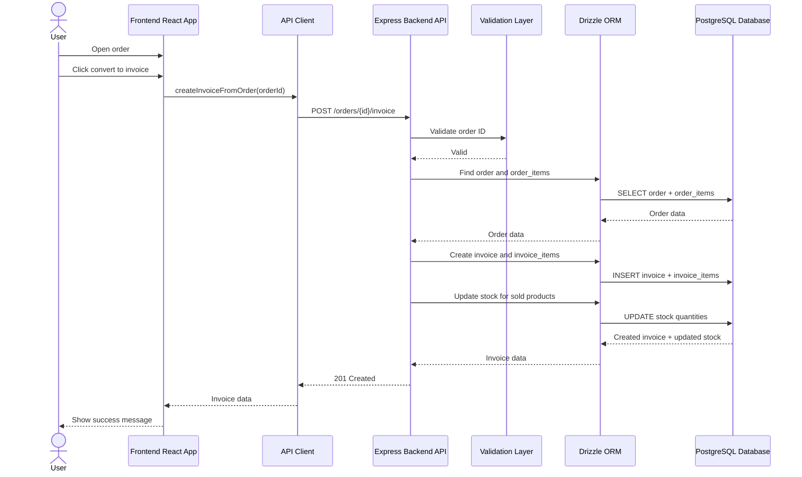
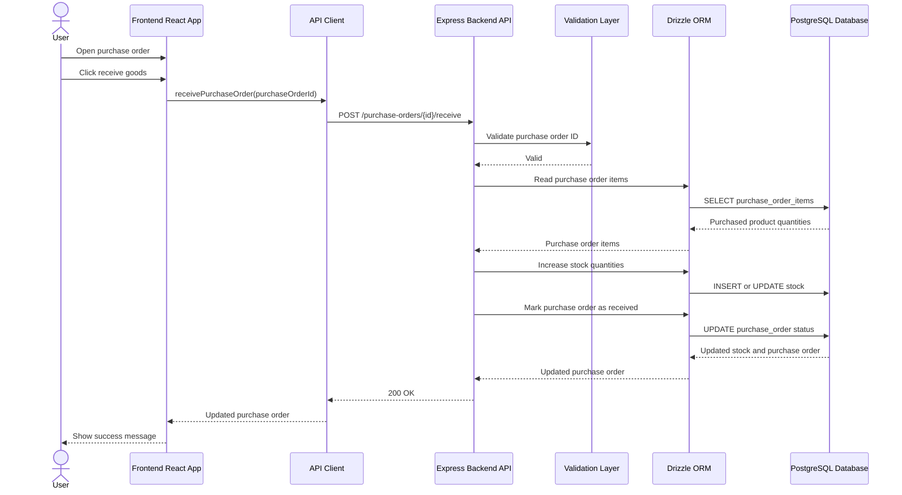
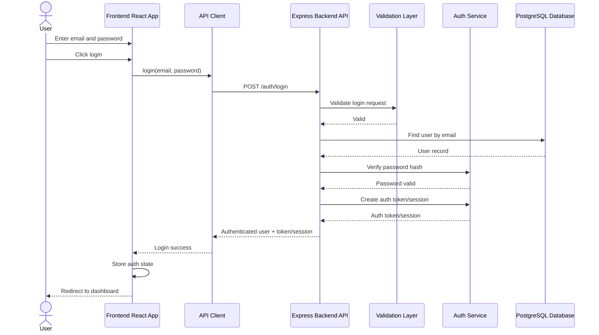

# Kovex ERP - Workflow Diagram Tools and AI Prompts

This file supports:

- TASK-067 - Create data flow diagram
- TASK-068 - Create use case diagram
- TASK-069 - Create sequence/activity diagrams

Use these prompts in Replit AI, OnUML, UMLGen, Mermaid Chart, SmoothMermaid, DrawMagic, Flowmapr, or another AI diagram tool.

## Recommended Websites

### Mermaid Live Editor

Website: https://mermaid.live

Best for:
- Mermaid flowcharts
- Sequence diagrams
- Activity-style workflow diagrams
- Quick export as SVG/PNG

Use when you already have Mermaid code and want to preview or export it.

### Mermaid Chart

Website: https://mermaid.ai

Best for:
- Mermaid diagrams with a polished editor
- Flowcharts
- Sequence diagrams
- ER diagrams
- User journeys

Use when you want Mermaid diagrams with a more visual workspace.

### OnUML

Website: https://onuml.com

Best for:
- AI-generated UML diagrams
- Use case diagrams
- Sequence diagrams
- PlantUML, Mermaid, and draw.io style outputs

Use when you want to paste a natural-language prompt and generate UML quickly.

### UMLGen

Website: https://www.umlgen.com

Best for:
- Text-to-UML generation
- Use case diagrams
- Sequence diagrams
- Activity diagrams
- Exporting simple academic UML diagrams

Use when you want the easiest natural-language UML generation.

### SmoothMermaid

Website: https://smoothmermaid.com

Best for:
- AI-generated Mermaid diagrams
- Flowcharts
- Sequence diagrams
- ER diagrams
- Architecture visuals

Use when you want Mermaid output generated from a text prompt.

### DrawMagic

Website: https://drawmagic.pro/mermaid

Best for:
- AI Mermaid flowcharts
- Sequence diagrams
- Quick text-to-diagram generation

Use when you want fast Mermaid output from a plain English prompt.

### Flowmapr

Website: https://www.flowmapr.com

Best for:
- BPMN
- UML sequence diagrams
- ERD
- C4 architecture
- Flowcharts

Use when you want more formal workflow or system-process diagrams.

### diagrams.net / draw.io

Website: https://app.diagrams.net

Best for:
- Manual editing
- Final polishing
- Use case diagrams
- Data flow diagrams
- System architecture diagrams

Use when AI gives you a rough diagram and you want to make it look professional.

## TASK-067 Prompt - Data Flow Diagram

Paste this prompt into an AI diagram tool:

```text
Create a professional Data Flow Diagram for a graduation project named "Kovex ERP".

The diagram must show how data moves through these modules:
1. Sales
2. Purchases
3. Inventory
4. Reports

Actors:
- Admin
- Employee / Business User

External interfaces:
- Browser / Frontend
- REST API
- PostgreSQL Database
- PDF / Excel Export

Main data stores:
- Customers
- Suppliers
- Products
- Warehouses
- Stock
- Quotations
- Orders
- Invoices
- Purchase Orders
- Purchase Invoices
- Reports

Sales flow:
- User enters customer data.
- User creates a quotation.
- System saves quotation and quotation items.
- User converts quotation to order.
- System saves order and order items.
- User converts order to invoice.
- System saves invoice and invoice items.
- Invoice/sales data becomes available for sales reports.

Purchase flow:
- User enters supplier data.
- User creates purchase order.
- System saves purchase order and purchase order items.
- User receives goods.
- System updates stock quantities.
- User creates purchase invoice.
- Purchase data becomes available for purchase reports.

Inventory update flow:
- Product and warehouse data are stored.
- Sales operations decrease stock.
- Purchase receiving increases stock.
- Stock table stores product quantity per warehouse.
- Low stock and stock value are used in inventory reports.

Reports flow:
- User selects report filters such as date range, customer, supplier, or product.
- Frontend sends filter parameters to REST API.
- Backend reads sales, purchase, inventory, and stock data from PostgreSQL.
- Backend returns report totals, chart rows, and top items.
- User can export report as PDF or Excel.

Diagram requirements:
- Use a clean academic style.
- Use clear arrows showing data movement.
- Group processes into Sales, Purchases, Inventory, and Reports.
- Show PostgreSQL as the central database.
- Show PDF/Excel export as an output from Reports.
- Include title: "Kovex ERP Data Flow Diagram".
- Make it suitable for a graduation report.
```

## TASK-067 Mermaid Template - Data Flow Diagram

Paste this into Mermaid Live Editor:



## TASK-068 Prompt - Use Case Diagram

Paste this prompt into an AI UML/use-case tool:

```text
Create a UML Use Case Diagram for a graduation project named "Kovex ERP".

Actors:
1. Admin
2. Employee / Business User

System boundary:
"Kovex ERP System"

Admin permissions:
- Login
- Manage users
- Manage roles and permissions
- View dashboard
- Manage customers
- Manage suppliers
- Manage products
- Manage warehouses
- Manage stock
- Manage quotations
- Convert quotation to order
- Manage orders
- Convert order to invoice
- Manage invoices
- Manage purchase orders
- Receive purchased goods
- Manage purchase invoices
- View sales report
- View purchase report
- View inventory report
- Export reports as PDF or Excel
- Manage projects
- Manage tasks

Employee / Business User permissions:
- Login
- View dashboard
- Manage allowed business records based on role
- Manage customers if sales role
- Manage quotations and orders if sales role
- Manage suppliers and purchase orders if purchasing role
- Manage products, warehouses, and stock if inventory role
- Manage invoices and reports if accountant role
- Manage projects and tasks if planner role
- View reports if permitted

Permission reflection:
- Admin has full access to all use cases.
- Employee has limited access based on assigned role.
- Show role-based permission as a note or relationship.

Diagram requirements:
- Use UML use case notation.
- Show Admin and Employee actors.
- Put all use cases inside the Kovex ERP System boundary.
- Clearly show that Admin has full access.
- Clearly show that Employee access is role-based.
- Include title: "Kovex ERP Use Case Diagram".
- Make it suitable for a graduation report.
```

## TASK-068 Mermaid Template - Use Case Style Diagram

Mermaid does not have native UML use case syntax, but this flowchart works well for reports:

```mermaid
flowchart LR
  Admin[Admin]
  Employee[Employee / Business User]

  subgraph System[Kovex ERP System]
    Login((Login))
    Dashboard((View Dashboard))
    Users((Manage Users))
    Roles((Manage Roles and Permissions))
    Customers((Manage Customers))
    Suppliers((Manage Suppliers))
    Products((Manage Products))
    Warehouses((Manage Warehouses))
    Stock((Manage Stock))
    Quotations((Manage Quotations))
    QuoteToOrder((Convert Quotation to Order))
    Orders((Manage Orders))
    OrderToInvoice((Convert Order to Invoice))
    Invoices((Manage Invoices))
    PurchaseOrders((Manage Purchase Orders))
    ReceiveGoods((Receive Purchased Goods))
    PurchaseInvoices((Manage Purchase Invoices))
    Reports((View Reports))
    ExportReports((Export PDF / Excel))
    Projects((Manage Projects))
    Tasks((Manage Tasks))
  end

  Admin --> Login
  Admin --> Dashboard
  Admin --> Users
  Admin --> Roles
  Admin --> Customers
  Admin --> Suppliers
  Admin --> Products
  Admin --> Warehouses
  Admin --> Stock
  Admin --> Quotations
  Admin --> QuoteToOrder
  Admin --> Orders
  Admin --> OrderToInvoice
  Admin --> Invoices
  Admin --> PurchaseOrders
  Admin --> ReceiveGoods
  Admin --> PurchaseInvoices
  Admin --> Reports
  Admin --> ExportReports
  Admin --> Projects
  Admin --> Tasks

  Employee --> Login
  Employee --> Dashboard
  Employee -. role-based access .-> Customers
  Employee -. role-based access .-> Quotations
  Employee -. role-based access .-> Orders
  Employee -. role-based access .-> Suppliers
  Employee -. role-based access .-> PurchaseOrders
  Employee -. role-based access .-> Products
  Employee -. role-based access .-> Stock
  Employee -. role-based access .-> Invoices
  Employee -. role-based access .-> Reports
  Employee -. role-based access .-> Projects
  Employee -. role-based access .-> Tasks
```



## TASK-069 Prompt - Sequence and Activity Diagrams

Paste this prompt into an AI sequence/activity diagram tool:

```text
Create four professional diagrams for a graduation project named "Kovex ERP".

The diagrams must include:
1. Quotation to Order Sequence Diagram
2. Order to Invoice Sequence Diagram
3. Purchase to Stock Sequence Diagram
4. Login Sequence Diagram

Use these participants:
- User
- Frontend React App
- API Client
- Express Backend API
- Validation Layer
- Drizzle ORM
- PostgreSQL Database

Diagram 1: Quotation to Order sequence
- User opens quotation.
- User clicks convert to order.
- Frontend calls API client.
- API client sends request to backend.
- Backend validates quotation ID.
- Backend reads quotation and quotation items from database.
- Backend creates order and order items.
- Backend returns created order.
- Frontend shows success message.

Diagram 2: Order to Invoice sequence
- User opens order.
- User clicks convert to invoice.
- Frontend calls API client.
- Backend validates order ID.
- Backend reads order and order items.
- Backend creates invoice and invoice items.
- Backend decreases stock if required by sales workflow.
- Backend returns created invoice.
- Frontend shows success message.

Diagram 3: Purchase to Stock sequence
- User creates or opens purchase order.
- User clicks receive goods.
- Frontend calls API client.
- Backend validates purchase order ID.
- Backend reads purchase order items.
- Backend updates stock quantities for purchased products.
- Backend marks purchase order as received.
- Backend returns updated purchase order.
- Frontend shows success message.

Diagram 4: Login sequence
- User enters email and password.
- Frontend sends login request.
- Backend validates request.
- Backend finds user by email.
- Backend verifies password hash.
- Backend creates authentication token or session.
- Backend returns authenticated user data.
- Frontend stores auth state.
- Frontend redirects user to dashboard.

Design requirements:
- Use UML sequence diagram style.
- Show clear request and response arrows.
- Include validation and database steps.
- Include success feedback to the user.
- Make diagrams suitable for a graduation report.
```

## TASK-069 Mermaid Template - Quotation to Order Sequence



## TASK-069 Mermaid Template - Order to Invoice Sequence



## TASK-069 Mermaid Template - Purchase to Stock Sequence



## TASK-069 Mermaid Template - Login Sequence


